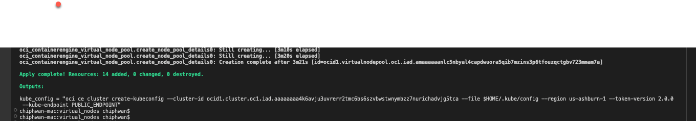

# OCI-OKE-Virual-Nodes-Terraform

## Introduction

The Terraform stack named OCI-OKE-Virtual-Nodes facilitates the deployment of an Oracle Container Engine for Kubernetes (OKE) Virtual Nodes cluster in your tenancy. This stack will automatically provision the necessary network infrastructure components such as Virtual Cloud Network (VCN), subnets, Internet Gateway, NAT Gateway, and security rules. Additionally, you can deploy the relevant policies in the root compartment of your tenancy to enable operations of OKE Virtual Nodes.

## Pre-requisites

- [OCI CLI installed with the required credentials to deploy OKE in your tenancy](https://docs.oracle.com/en-us/iaas/Content/API/SDKDocs/cliinstall.htm)
- [kubectl installed and using the context for the Kubernetes cluster where the MDS resource will be deployed](https://kubernetes.io/docs/tasks/tools/)
- [Terraform Installed](https://developer.hashicorp.com/terraform/tutorials/aws-get-started/install-cli)

## Installation of Terraform stack

**1. Clone or download the contents of this repo** 
     
     git clone https://github.com/chiphwang1/oke-virtual-node-terraform.git

**2. Change to the directory that holds the Terraform stack** 

      cd ./oke-virtual-node-terraform

**3. Populate the varaibles.tf file**

**4. Install the Helm chart. Best practice is to assign the username and password during the installation of the Helm chart instead of adding it to the values.yam file.**

     terraform init
     terraform plan
     teraffrom apply
  

**5. Add Kubeconfig of Virtual Node cluster**

     run oci command in output of terraform apply

     

**7. To remove Terraform stack**

     terraform destroy
     
 
## MySQL DB System value.yaml Specification

| Variables                          | Description                                                         | Type   | Mandatory |
| ---------------------------------- | ------------------------------------------------------------------- | ------ | --------- |
| `compartment_id` | Compartment to deploy OKE Virtual Nodes cluster | string | yes  |
| `region` | region to deploy the OKE Virtual Nodes Cluster  | string | yes     |
| `node_shape` | The shape of Virtual Nodes | string | yes       |
| `node_size` | The name of Virtual Nodes in the node pool  | number | yes       |
| `create_oke_virtual_node_policy` | To create the policy for for Virtual Node operations. Set to "true" to create the policy | bool | yes       |

## Useful commands 

**1. To check the status of the MySQL DB System run the following command**
     
     kubectl -n <namespace of mysqldbsystem> get mysqldbsystems -o wide

**2. To describe the MySQL DB System run the following command** 
     
     kubectl -n <namespace of mysqldbsystem> describe mysqldbsystems <name of mysqldbsystem>

**3. To retreive the OCID of MySQL DB System run the following command** 

      kubectl -n <namespace of mysqldbsystem> get mysqldbsystems <name of mysqldbsystem> -o jsonpath="{.items[0].status.status.ocid}"
 
**4. To retrive the admin username of the MySQL DB System run the following command**
     
     kubectl -n  <namespace of mysqldbsystem>  get secret mysqlsecret -o  jsonpath="{.data.username}" | base64 --decode

**5. To retrive the admin password of the MySQL DB System run the following command**
     
     kubectl -n  <namespace of mysqldbsystem>  get secret mysqlsecret -o  jsonpath="{.data.password}" | base64 --decode

**6. To retreive endpoint information for the MySQL DB System run the following command**
     
     kubectl -n <namespace of mysqldbsystem> get secret <name of the MySQL DB System>  -o jsonpath='{.data.Endpoints}' | base64 --decode

## Additional Resources

- [OCI Service Operator for Kuberntes (OSOK) deployed in the cluster](https://github.com/oracle/oci-service-operator)
- [MySQL SB System Service](https://www.oracle.com/mysql/)
